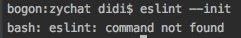
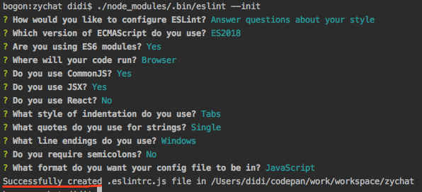
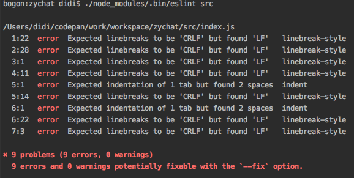
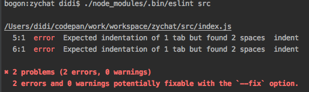
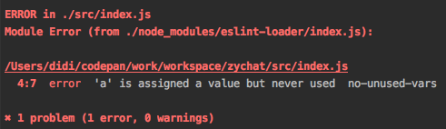
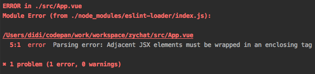
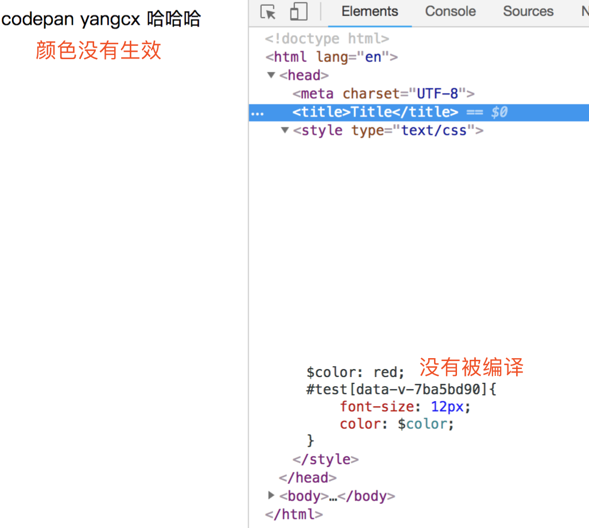
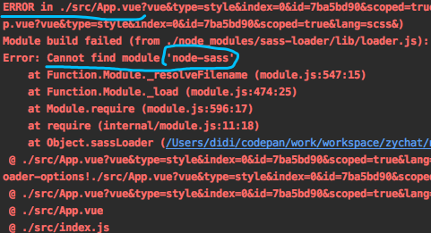
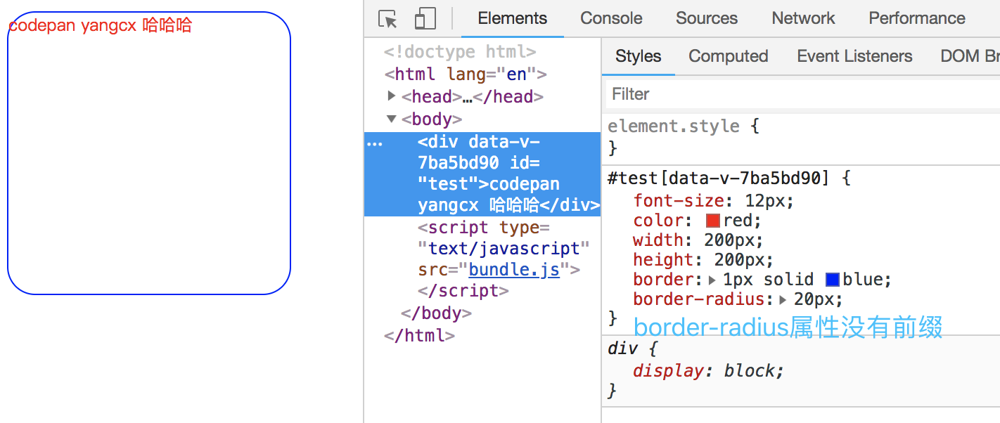
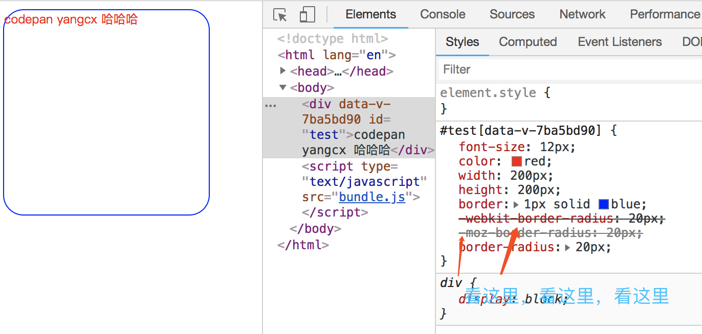

其实到目前为止，已经可以开始撸代码了，但是这是2018年，不用高大上的东西会被累（嘲）死（笑）的。高大上的东西包括：
* css预处理器：less sass stylus ... postCSS（这个有些奇葩，后面会说到）
* es6/7/8语法：据说webpack4已经支持编译es6语法了，即可以不用babel这玩意进行转换了，我测试了一下，好像真的可以。
但是它是否可以完全替代babel，因为项目该开始，还不知道有什么坑，那就暂且不使用babel了。注意：webpack4.*以前的版本不支持哦，必须使用babel转换，不然有些浏览器不认识这语法。
* js语法检查器：eslint 不使用它并无大碍，只是合作开发还是约法三章比较好

# vue中使用eslint
## 单独使用eslint
eslint和使用vue或webpack一样，可以通过npm进行安装
```
npm i -D eslint
```
就像webpack在工作时需要`webpack.config.js`配置一样，eslint也需要一个配置文件，叫做`.eslintrc.js`，我们接下来将在项目根目录下面创建这个文件，以用来告诉eslint如何工作。

但是且慢，自己动手写这个配置文件对于小白来说还是有一定困难的，至少我不查文档写不出来，幸运的是官方给了我们一个现成的命令采用问答的形式去创建这个配置文件。
```
eslint --init
```
这个命令是不是和`npm init`非常像。类比学习是我一直保持的学习方式：
* `npm init`可以初始化一个package.json文件
* `eslint --init`可以初始化一个.eslintrc.js文件

*类比一下我相信你很快就能理解eslint如何使用了*

不幸的是，你的命令行报错了，像下面这样：



eslint命令找不到，找不到就是对的，能找到才奇怪，因为咱们是`npm i -D eslint`局部安装的，而不是`npm i -g eslint`全局安装的，当然找不到eslint命令。

有两种解决办法：
1. 全局安装eslint
```
npm i -g eslint
```
2. 采用局部执行的方式
```
./node_modules/.bin/eslint --init
```

请使用第二种方法，虽然命令执行起来很麻烦，但是后面我们会将eslint集成进webpack，也就是说后面webpack会帮我们调用eslint来进行代码规范检查，不用再敲命令了，所以第二种还行哦。
那为什么不用第一种呢？因为上面我也说了，后续会把eslint集成进webpack，那么势必会再安装一些`eslint-loader`（名字是我瞎猜的）之类的，如果全局安装了eslint，那么这些loader啊，插件啊都必须安装在全局，不然运行时就会报错，
这些东西装在全局，不就相当于js编程你定义的方法和属性全部都是全局的（挂载在window上面），你觉得这样行吗？

道理已经给你讲明白了，***FOLLOW ME JUST DO IT***

命令行输入上面的第二个命令，按回车，大概读读？读不懂？那就再按一次回车，然后你与命令行各种交互，按照下面的模板去生成



我不想解释上面的内容，因为百度翻译可以帮到你。最后看到"成功创建了.eslintrc.js文件"，此时，就会在项目根目录下面看到这个文件，打开它：
```
module.exports = {
    "env": {
        "browser": true,
        "commonjs": true,
        "es6": true
    },
    "extends": "eslint:recommended",
    "parserOptions": {
        "ecmaFeatures": {
            "jsx": true
        },
        "ecmaVersion": 2018,
        "sourceType": "module"
    },
    "rules": {
        "indent": [
            "error",
            "tab"
        ],
        "linebreak-style": [
            "error",
            "windows"
        ],
        "quotes": [
            "error",
            "single"
        ],
        "semi": [
            "error",
            "never"
        ]
    }
};
```
长上面这个样子，里面好多东西应该是看不懂的，在这里我不想讲了，后面会陆续穿插着讲，如果有强迫症就想现在搞懂，那你可以去看官网，也可以参考简书上面的这篇文章[eslint超简单入门](https://www.jianshu.com/p/ad1e46faaea2)。

接下来我们就去检查一下src目录下面js文件，运行
```
./node_modules/.bin/eslint src
```

`eslint src`的意思是让eslint去检查src目录下所有的js文件是不是符合规范，当然后面也可以跟一个文件，意思就是检查某个文件是否符合规范

我要哭了，竟然报了好多错误



这段`Expected linebreaks to be 'CRLF' but found 'LF' linebreak-style`错误翻译一下：

翻译：linebreak-style 期望通过'CRLF'换行，但是发现使用的是'LF'换行。

大写的那些单词，看的我是大写的尴尬，一脸懵逼，上网查吧，得到如下答案：
> Unix系统中换行符采用`\n`表示，被称为***LF***
> Windows系统中换行符采用`\r\n`表示，被称为***CRLF**
> eslint linebreak-style默认选用Unix

好吧，咱们上面在初始化.eslintrc.js文件的时候那项选择的是Windows，那改成Unix是不是就不报错了？算了，我不想尝试了，索性修改配置文件吧

在.eslintrc.js文件中找到下面这段代码
```
"linebreak-style": [
  "error",
  "windows"
]
```

解释一下上面那段代码（抄袭网上的一段话）
> ESLint 附带有大量的规则，修改规则应遵循如下要求：
>  * "off" 或 0 - 关闭规则
>  * "warn" 或 1 - 开启规则，使用警告级别的错误：warn (不会导致程序退出)
>  * "error" 或 2 - 开启规则，使用错误级别的错误：error (当被触发的时候，程序会退出)
>  
>有的规则没有属性，只需控制是开启还是关闭，像这样："eqeqeq": "off"；有的规则有自己的属性，使用起来像这样："quotes": ["error", "double"]，具体有没有自带属性，可查看eslint规则表。
  
默认你已经看懂了，修改代码如下：
```
"linebreak-style": "off"
```
再次运行`./node_modules/.bin/eslint src`



又报错了，说是：期望使用1个Tab键缩进，但却发现使用了2个空格缩进了。这错误我搞了好长时间，后来我发现和使用的IDE有关系，Webstorm默认1Tab=4Space，并且缩进采用的是space而不是tab，所以eslint就报告了这个错误，
而每个人用的IDE都不尽相同，救得了Webstorm我也救不了其他的呀，算了吧，干脆也关掉这项检查吧。但是关掉之后有人的代码tab缩进，有人的代码space缩进，有人的1tab=4space，有人的1tab=2space，and so on。

如果某天我又想统一代码的缩进风格了，加上了indent这项检查，那么恭喜你，加班吧。不过不要恐慌，后面我会再讲一种解决这个问题的办法，目前先这样，让eslint赶紧编译通过吧，我感觉这玩意真的很强（讨）大（厌）。

修改.eslintrc.js文件
```
"indent": [
  "error",
  "tab"
]
```
上面的代码改为：
```
"indent": "off"
```
再次运行`./node_modules/.bin/eslint src`，千呼万唤始出来，终于好了，可是回头发现，eslint的功能快被我禁用完了，那还用个毛eslint，哎，这不不太懂"江湖规矩"嘛，目前是摸着石头过河。


.eslintrc.js文件被我修改的乱七八糟的（谦虚的说法，其实一点也不乱是不是），修改之后的配置文件长相如下，请仔细检查每一项都要和我的一样哦
```
module.exports = {
  "env": {
    "browser": true,
    "commonjs": true,
    "es6": true
  },
  "extends": "eslint:recommended",
  "parserOptions": {
    "ecmaFeatures": {
      "jsx": true
    },
    "ecmaVersion": 2018,
    "sourceType": "module"
  },
  "rules": {
    "indent": "off",
    "linebreak-style": "off",
    "quotes": [
      "error",
      "single"
    ],
    "semi": [
      "error",
      "never"
    ]
  }
};
```

好吧 上面balabala说了一大堆，其实最后就是生成了这么个玩意，并且又修改了初始化的.eslintrc.js文件，文件中的配置项几乎也全都看不懂，没事，真的没事，在这里我要给你吃颗***定心丸***：
***真的不用看懂，上面我所讲的没看懂也不打紧，后面陆续会非常透彻的讲！***

目前为止，我们的eslint环境算是通了，但是目前还和webpack没有任何瓜葛，想让webpack帮我们运行eslint，不想自己动手（就是这么倔强）怎么办？接下来，我就讲<eslint集成进webpack>
## eslint集成进webpack
回忆一下，vue集成进webpack我们安装了vue-loader，css集成进webpack我们安装了css-loader，找规律的题目小学生都会，eslint集成进webpack我们需要安装eslint-loader

接下来的要务是webpack集成eslint，根据前面的经验，说白了也就是下载安装eslint-loader，然后在webpack.config.js文件中配置进去而已。我不讲了自己搞吧（开个玩笑，这里面还有坑存在，我得扶你一把）

下载安装：
```
npm i -D eslint-loader
```
打开webpack.config.js文件，在rules配置项中加进去如下代码：
```js
 module: {
    rules: [
      ...
      {
        test: /.js$/,
        loader: 'eslint-loader',
        enforce: 'pre',
        // exclude: /node_modules/,
        include: path.resolve(__dirname, 'src')
      }
    ]
  }
```
* test和loader两个属性我不想解释了，自己悟
* enforce：指明该loader是进行预处理的loader，先对指定文件进行eslint后才会执行babel编译啊，压缩啊，混淆啊等后续工作
* include：用来告诉loader处理的范围（目录或文件），不要狗拿耗子多管闲事。如上的意思是只处理src目录下面的所有js文件，为什么要指定范围？
因为node_modules目录下面（当然不仅仅是这个目录，还有其他好多文件，这里只是拿它举个栗子而已）也有很多的文件，你去检验人家的代码规范，别人的代码人家凭啥听你的，你咋这么厉害呢，那肯定是满屏的错误，所以只管好你自己的开发目录（src目录）就行了。
* exclude: 和include正好相反，他是告诉loader忽略检查哪些目录或者说哪些文件，这个被我注释了，咱们就先用include

OK，迫不及待想小试牛刀，看看webpack嫩不能帮我们启动eslint，并对src目录下面的js文件就行规范检查的工作

首先让我们制造个错误（其实也不算错误，顶多也就是不符合eslint默认的规范而已），打开index.js文件
```js
import Vue from 'vue'
import App from './App.vue'

let a = 3 // 加入这行代码

new Vue ({
  el: '#app',
  render: h => h(App)
})
```
上面我们定义了一个变量a，但是并没有使用它

控制台输入命令：`npm run build`，发现控制台报错了



翻译一下：src目录下面的index.js文件发生了错误，错误在第4行第7列，变量a被声明了但是从来没有使用过它，触发了eslint的`no-unused-vars`规范

出现错误，就说明我们配置的没有错误（这句话好绕哦），webpack帮我们启动了eslint，并且eslint也正常工作了

上面我们只test了js文件，但是我们的App.vue文件中也存在js代码，也需要校验，所以修改一下test，使其也能匹配到vue文件
修改下面的这个test
```
{
    test: /.js$/,
    loader: 'eslint-loader',
    ...
}
```
变为如下代码：(正则表达式的基本功应该得会点)
```
{
    test: /.(js|vue)$/,
    loader: 'eslint-loader',
    ...
}
```
然后再次运行`npm run build`，发现控制台又多了一个错误：



大概意思是：错误发生在App.vue文件中的第5行第1列，解析错误：相邻的JSX元素必须封装在封闭的标签中

其实翻译完了，我还是一脸懵逼，不知其所云。于是去国外的网站（某度完全搜不到）找答案，eslint默认把不是js文件中的js代码全部当做JSX（React中非常重要的概念）对待，而JSX有个要求就是需要在最外层包裹一个父元素，
而我们vue文件中的js代码直接裸露在`<script>`标签中的，根本没有包裹父元素（当然也没法包裹，因为会报错，不要问我为什么会报错，自己想）。粘一段StackOverflow上面的代码，帮助理解一下。

eg：
```
render () {
    return(
        <div id="div1"></div>
        <div id="div1"></div>
    )
}
// It should be wrapped in a parent element
render () {
    return(
        <div id="parent">
            <div id="div1"></div>
            <div id="div1"></div>
        </div>
    )
}
```

接下来思考这个问题，还记得上面检查src目录时候的命令吗？复习一下吧：`./node_modules/.bin/eslint src`，然后你有没有发现它只检查了src目录下的index.js文件，可是src目录下还有个App.vue文件，而eslint没有校验App.vue（完全没把App.vue放在眼里啊），
这是为什么呢？

说到底根本原因是因为eslint默认只会校验js文件中的js代码（其实它默认也只能处理js文件）。

但是我们的App.vue中`<script>`标签里面也有js代码，这可是核心代码，还有html文件中也有可能存在js代码，那这两种文件中的js代码又该如何才能让eslint所支持，并且去校验它呢？

***插件，插件，插件***（重要的事情说三遍），使用插件来让eslint支持，这个插件就是`eslint-plugin-html`

```
npm i -D eslint-plugin-html
```
请告诉eslint，我要给你安装插件了，不然光下载是没用的，打开.eslintrc.js文件
```
module.exports = {
 ...
  "plugins": [
    "html"
  ],
  "rules": {
   ...
  }
};
```
在`rules`配置项的上面（位置只是个人爱好）加一个`plugins`配置项，值是一个数组，我们加入`html`，这样就成功地给eslint添加了一个`eslint-plugin-html`插件。注意eslint的插件的命名规则都是`eslint-plugin-xxx`，所以官方为了方便，我们在配置
插件的时候只需要写出`xxx`就行了。

再次运行`npm run build`，发现App.vue被成功检查了，没有报错，控制台目前只剩下那个变量定义但未使用的问题了

我觉得是时候解释一下.eslintrc.js文件中的各项配置了
* env 是告诉eslint咱们的js代码运行环境的。告诉它代码在browser（浏览器）中运行，里面会有模块（commonjs）语法
，也会有ES6的语法
* extends 前面一直说校验代码需要遵循编码规范，那么这个规范到底是什么？又怎么告诉eslint咱们的规范呢？
规范就是经过前人验证的最佳实践（所谓最佳实践，就是大家伙都觉得应该遵守的编码规范而已），目前已经产生了许许多多的编码规范，eslint将这些规范定义成了文件，然后内置在自己里面，想用哪一套规范，就通过extends这个配置项就行配置。
文件中的`eslint:recommended`就是eslint官方默认的一套规范，当然我们也可以自定义规范，而目前也有好多第三方的eslint规范被发布，我们也可以引用第三方的规范，但是没学会走就别想着跑了，稳当点
* rules 这个东西是配合extends使用的，就是当extends指定的规范中有些规范不符合我们的要求时，或者说没有我们想要的规范时，可以在这个配置项中进行配置。相当于对默认规范的一种覆盖和扩展的操作。

    rules配置项是一个js对象
    * key就是eslint事先定义好的各种各样的规范名字
    * value就是配置如何使用这个规范。
    
        value有字符串例如：`"indent": "off"`，也有数组例如`"quotes": ["error", "single"]`
        ，区别就是有的规则没有属性，只需要控制是开始还是关闭，就像`indent`，有的规则有自己的属性，使用起来就像`quotes`。具体有没有属性，上网查吧
    * 控制开启还是关闭的方式如下（下面三项被称为规则级别）：
        * "off" 或 0 - 关闭规则
        * "warn" 或 1 - 开启规则，不满足规则时控制台会给出警告：warn (程序不会退出)
        * "error" 或 2 - 开启规则，不满足规则是控制台会直接报错：error (程序会退出)
    * 对于有属性的规则，数组第一个元素是规则级别，数组第二个元素是规则的属性
* parserOptions 指定校验的ECMA的版本，以及ECMA的一些特性
    * ecmaVersion 指定ECMAScript的版本，版本有3、5（默认）、6
        ECMAScript6（ES6），也可以叫ECMAScript2015（ES2015）
        ECMAScript7，也可以叫ECMAScript2016
        ECMAScript8，也可以叫ECMAScript2017
    * sourceType 指定源代码存在的位置，取值为script | module，默认为script
    * ecmaFeatures 表示一些附加特性的对象，或者说指定要使用其他哪些语言对象
        * jsx 支持jsx语法

还想了解更多配置，[请移步到这篇文章](https://blog.csdn.net/mafan121/article/details/77965252)
# vue中使用sass
sass是个css预处理器，就是可以定义变量、方法、代码块等等的一个东西，相信你懂，不太懂的话继续百度。

先看看webpack4.*能不能自己处理sass语法（抱着试一试的态度），我们打开App.vue文件，修改`<style>`标签中的内容如下：
```scss
<style scoped lang="scss">
    $color: red;
    #test{
        font-size: 12px;
        color: $color;
    }
</style>
```

Tip：
* 在vue1.*中，编写scss代码需要这么写：`<style rel="stylesheet/scss" lang="scss"></style>`
* 在vue2.*中，编写scss代码仅需这么写：`<style lang="scss"></style>`

运行`npm run dev`，打开浏览器看看，文字是黑色，再看看浏览器控制台：

足以证明webpack是不支持sass的，我们让它支持需要做些什么，仍然是类比的方式去思考-------`sass-loader`（我相信你也想到的是它）

下面我们就去安装并且配置它，然后再次运行，完事文字变成红色的话，那就说明我们的项目已经可以支持sass了，OK ，Just Do It！！！

```
npm i -D sass-loader
```
然后打开webpack.config.js文件，准备配置sass-loader
```
module.exports = {
  ...
  module: {
    rules: [
      ...
      {
        test: /.scss$/,
        use: ['style-loader', 'css-loader', 'sass-loader']
      }
    ]
  }
}
```
在rules再加如上的配置，意思是scss文件我们使用sass-loader处理后变成css然后交给css-loader，最后再交给style-loader

运行`npm run dev`



报错了，提示也很明白：App.vue文件发生了错误，在sass-loader执行的时候没有发现`node-sass`模块，好吧，sass-loader模块的运行依赖node-sass，所以，下面安装一下`node-sass`
```
npm i -D node-sass
```
继续顽强地运行`npm run dev`，如果不出意外的话，文字变成了红色，打开浏览器控制台看看刚才的sass代码也被顺利的编译成了css

# vue中使用postCSS
为什么要使用postCSS，要彻底搞懂这个就必须了解一下程序员这些年来编写CSS代码的编程历程
## CSS编程历程
* 刀耕火种的年代

    使用css撸样式，真的非常痛苦
    * 选择器的层层嵌套
    * 样式的大量冗余
    * 代码无法复用
    * 没有任何编程能力
* 汽车横行的年代

    使用less、sass(scss)、stylus等这些css预处理语言去编写css，然后编译成css文件，
    世界美好了很多，解决了原生css的诸多问题，但是还有一些问题它们无法解决，那就是
    * 浏览器样式兼容问题，例如border-radius属性、display:flex属性、transform属性等等
    * ...剩下的我暂时不清楚了
* 人类移居的年代

    postCSS的横空出世，刷新了我的世界观，可以这么来理解它：less、sass、stylus是css预处理器，而postCSS可以理解它是一个平台，可以给它安装各种插件，让这些插件在它上面发挥各自的功能

    它提供了一个解析器，可以将CSS解析成抽象语法树
    
    通过postCSS这个平台，我们能够开发一些插件，来处理CSS。例如炙手可热的插件-autoprefixer（自动补全前缀）
    
## 安装postCSS和autoprefixer

postCSS功能很强大，但是目前只用到它里面一个很火的autoprefixer插件，有点大炮打苍蝇的感觉，但是咱们要使用牛逼的css3的新特性啊，为了保险起见，还是得用这个插件的

安装之前我们先改造一下App.vue文件，编写一些css的新特性，以便一会测试autoprefixer到底有没有起作用，好不好使。

打开App.vue文件，添加几行样式,width往下4行是新添加的
```
<style scoped lang="scss">
    $color: red;
    #test{
        font-size: 12px;
        color: $color;

        width: 200px;
        height: 200px;
        border: 1px solid blue;
        border-radius: 20px;
    }
</style>
```
运行我们的项目，看看页面的效果

为你呈现了一个圆角正方形，仔细观察`border-radius`样式此时是没有任何浏览器前缀的

下面就给它添加前缀，等咱们下面的一顿操作之后，前缀添加上了，说明大功告成，***妈妈再也不用担心添加前缀了***

安装必要的插件
```
npm i -D postcss autoprefixer
```

安装完成之后，我们需要将postcss集成进webpack，所以还需要安装postcss-loader
```
npm i -D postcss-loader
```

打开我们的webpack.config.js文件,修改scss配置
```
{
    test: /.scss$/,
    use: ['style-loader', 'css-loader', 'sass-loader']
}
```
修改为如下的配置：
```
{
    test: /.scss$/,
    use: [
      'style-loader',
      'css-loader',
      {
        loader: 'postcss-loader',
        options: {
          plugins: [require('autoprefixer')('last 100 versions')]
        }
      },
      'sass-loader'
    ]
}
```

解释一下语法吧
* `use`是个数组，原本数组中装的是loader对象，而loader对象又可以简写为一个字符串。

    举例说明一下：
    
    `'style-loader'`
    
    其实是
    ```
    {
        loader: 'style-loader'
    }
    ```
    的简写而已，所以你会看到use数组既有字符串元素，又有对象元素
* `options.plugins` 是为postcss安装插件
* `require('autoprefixer')()` 是安装一个autoprefixer插件
* `'last 100 versions'`是向autoprefixer传入的参数，意思是添加前缀时，需要兼容各个浏览器最近100个版本


重启项目，会看到浏览器控制台中前缀已经被加上




其实还想将一些其他的东西，算了，这节编写的时间太长了，需要抓紧更新一版了，下节见-dev5


