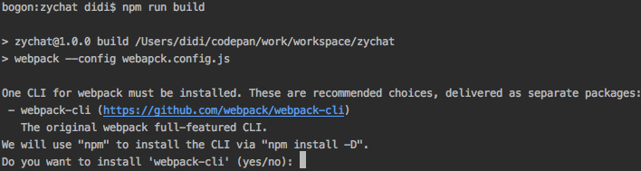
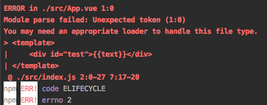
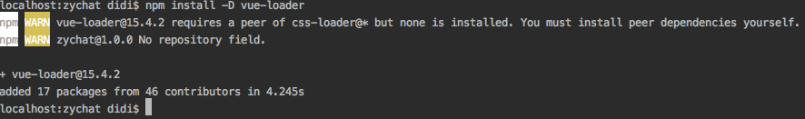
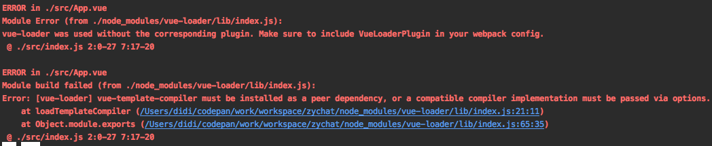
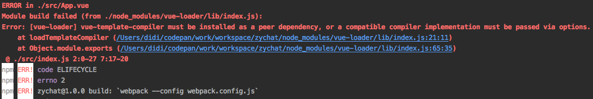
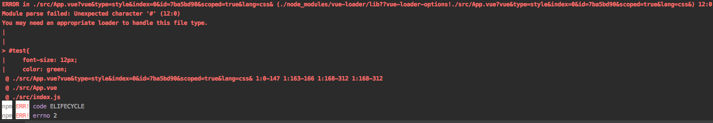

# 项目架构的搭建
## 初始化项目架构
打开终端 初始化npm项目
```
mkdir zychat # zychat即为项目名称
cd zychat # 进入项目
npm init # 此项项目根目录下面就会出现一个package.json的文件，这是npm项目的配置文件
```
安装依赖
项目使用vue+webpack技术实现，所以不用多说，肯定需要安装vue和webpack两个包
```
npm i -D vue webpack
```
创建源代码目录 src
```
mkdir src
```
新建一个App.vue文件，然后写入如下代码
```vue
<template>
    <div id="test">{{text}}</div>
</template>

<script>
  export default {
    text: 'codepan yangcx'
  }
</script>

<style scoped>
    #test{
        font-size: 12px;
        color: green;
    }
</style>
```
* 这个vue文件是无法在浏览器中直接运行的，因为浏览器压根不认识这种文件类型啊（浏览器内心独白：臣妾做不到啊）。
* 那我们的办法就是使用webpack将其打包处理成浏览器能认识的文件类型，回忆一下：C能识别的资源类型有：html,css,js,image(png,jpeg),json等等
* 再看上面的vue文件我们会发现`<template>`标签里面是html代码，`<script>`标签里面是js代码，`<style>`标签里面是css代码，那么有什么文件可以同时包含上面三种资源呢？
* 答案是：只有js文件，没错，js文件是不二选择，webpack也是这么想的。webpack把所有的资源都按模块对待，每个文件都是一个模块，将这些模块按照其之间的依赖关系最后打包成一个统一的js文件然后输出出来。
* 注意上面的措辞：
    * "按照依赖关系"，那这个依赖关系webpack有是怎么知道的呢？当然是我们告诉它呀，怎么告诉呢？答案是通过一个js文件来告诉它，这个js文件被称为打包入口文件，webpack打包时就会首先读取这个入口文件，然后根据依赖关系一个个去处理
    * "最后打包成一个统一的js文件然后输出出来"，那这个打包后的文件放在哪里，该叫什么名字，我们得告诉webpack吧，不要为难人家好吗？（当然webpack4.*之后默认的入口为'./src/'和默认出口'./dist'）

巴拉巴拉这么长时间，你应该明白接下来需要做两件事，一件事是我们需要创建一个js文件，作为webpack打包时的入口文件
在src目录下面新建一个index.js文件
```vue
import Vue from 'vue'
import App from './App.vue'

const root = document.createElement('div')
document.body.appendChild(root)

new Vue ({
  render: h => h(App)
}).$mount(root)
```
另一件事是我们需要告诉webpack入口文件是哪个，打包后输出文件该放在哪里，文件名该叫什么？问题来了怎么告诉webpack呢？好在官方想到我们会有这个疑惑，状告无门是最痛苦的，默认webpack会读取项目根目录下面一个叫做`webpack.config.js`的文件作为其配置文件，这个文件的作用大白话解释就是："你想对webpack说的话就请在这个文件里说吧！"
好了，我们在根目录下面创建webpack.config.js文件
```js
// 引入path模块，这个模块是nodejs内置模块，用来处理路径的
const path = require('path')

// module.exports是commonjs模块化的语法，nodejs模块采用的就是commonjs模块规范
module.exports = {
  // entry: 告诉webpack，入口文件去这里找
  entry: path.join(__dirname, './src/index.js'), // __dirname是node内置变量，表示当前文件所在的目录，join方法将前者和后者拼接成绝对路径
  // output：告诉webpack，输入文件具体参见这里
  output: {
    filename: "bundle.js", // 打包后的文件芳名是bundle.js
    path: path.join(__dirname, 'dist') // 打包后的文件家庭住址在dist目录下面
  }
}
```

基本差不多了，我们现在可以使用webpack去打包当前项目，webpack打包项目是使用webpack命令进行打包的，并且得告诉它一些参数，可是webpack命令每次都在命令行手敲一遍，着实非常痛苦。
npm太贴心了，它可以让我们在package.json文件中配置命令的快速执行。package.json中有一个scripts属性，该属性下面配置需要执行的命令，key代表命令，value代表真正需要执行的命令，然后通过`npm run key`就相当于执行value。
打开package.json文件，在里面加入如下代码：
```
 "scripts": {
    "test": "echo \"Error: no test specified\" && exit 1", // 这个是默认生成的，不用理会
    "build": "webpack --config webpack.config.js" // 需要加入的，不用解释，相信你能够看懂
  },
```
现在是真的差不多了，是时候终端运行`npm run build`了，预期的结果是产生dist目录，目录下面产生bundle.js文件

Just Do It

```
npm run build
```

我好像又欺骗了你，控制台哐哐哐的报错，知错能改善莫大焉，认真看这些错误，肯定能看懂

英语太烂，大概翻译一下：必须安装一个webpack CLI的玩意，以下是推荐的一些选择，聪明的npm将帮你使用`npm install -D webpack-cli`，然后问你愿意吗，回答yes or no。

我懵逼了，webpack-cli是什么鬼，为什么需要它，它和webpack是什么关系，度娘一下，马上知道：

webpack打包是cli的功劳，在4.*版本以前cli是放在webpack包中的，而到了4.*这个功能被提出来单独放在webpack-cli中了
也就是说cli功能从webpack移到了webpack-cli，所以如果你要使用cli功能，除了安装 webpack 外，还需要安装 webpack-cli

刨根问底完毕，我们按照它说的做吧，输入yes回车，或者直接输入以下命令：
```
npm i -D webpack-cli
npm run build // 再次尝试build
```
不幸的又报错了



说是：App.vue模块解析失败，你可能需要安装一个适当的loader去处理这种文件类型
这提示我就不能忍，还是没有人聪明啊，什么叫适当的loader，难道你就判断不出来需要什么loader吗？
大胆猜测，这是vue文件，是否有一个叫做vue-loader的loader呢，于是上网寻找，发现"我简直太聪（自）明（恋）了"。
不扯了，安装这个`vue-loader`（其实这个loader稍微有些经验的coder一开始就会安装的，只是我想让你搞明白为什么要安装它，它是个什么东西，知其然也得知其所以然）
```
npm i -D vue-loader
```


出现了两条警告，第二条警告无关痛痒，可以先不管，请看第一条警告：
vue-loader需要一个css-loader,但是没有安装，你必须自己手动安装它，好吧，这里我解释一下css-loader是什么？为什么需要它？

> 观察vue文件，可以看出vue文件是由html、js、css三大块组成，咱们现在开发都是讲究模块化编程的，vue-loader也不例外，它把处理这三大块东西的工具也单独搞了模块，也就是说vue-loader需要依赖
处理html的模块和处理css的模块，才能正常工作，就像汽车需要加油/气/电才能发动一样的道理。

其中处理`<style>`中的内容的loader用脚后跟想想应该叫什么名字？没错，就是这个`css-loader`

听它的话，安装css-loader
```
npm i -D css-loader
```
继续执着的build，不要打我，又报错了，错误依然是说无法解析vue文件。why？明明已经安装vue-loader，为什么还是无法解析vue文件？

听我解释，你是不是傻，虽然你安装vue-loader模块不亦乐乎，但是webpack压根不知道你安装了呀，你需要告诉它：hi，webpack，我已经安装了vue-loader，你现在可以用这个loader去处理*.vue文件了。
好吧，接下来让我去嘱咐webpack吧
打开webpack.config.js文件
```
const path = require('path')

module.exports = {
  entry: path.join(__dirname, './src/index.js'),
  output: {
    filename: "bundle.js",
    path: path.join(__dirname, 'dist')
  },
  module: {
    rules: [
      {
        test: /.vue$/,
        loader: 'vue-loader'
      }
    ]
  }
}
```
增加module配置项，解释一下，顺带也说一下历史吧。
module.rules是个数组，里面指定处理各个文件类型的loader，举个栗子：使用vue-loader去处理后缀为vue的文件。
test是个正则表达式，匹配需要处理的文件类型；loader用来指定loader。

module.rules是webpack4.*的语法，以前的语法是module.loaders。

这次肯定行了，继续build，捂脸~~~，男人的话你怎么能相信呢？

翻译：vue-loader没有使用一个对应的插件。确定在你的webpack配置文件中包含了VueLoaderPlugin插件。
理解了，需要配置一个VueLoaderPlugin的插件，你是不是想问我VueLoaderPlugin插件是神马？怎么又要搞个这玩意？我想说我不（也）告（不）诉（知）你（道）。还是上网找找答案吧。
> vue-loader在15.*之后的版本都需要一个VueLoaderPlugin的

你妈先了解到这里，反正在我"小的时候"记得没有VueLoaderPlugin插件这个东西啊。
打开webpack.config.js文件，加入以下代码：
```
...
const {VueLoaderPlugin} = require('vue-loader')

module.exports = {
  ...
  module: {
    rules: [
      {
        test: /.vue$/,
        loader: 'vue-loader'
      }
    ]
  },
  plugins: [new VueLoaderPlugin()]
}

```
首先导入Plugin，然后通过plugins配置项将其添加进去，再次运行build

报错了，老生常谈的错误，还是提示vue-loader依赖一个vue-template-compiler模块，上面分析过vue文件，这个模块就是处理`<template>`里面的内容的，名字好变态怎么不叫`html-loader`呢，不按套路出牌。
那就安装呗：
```
npm i -D vue-template-compiler
```
运行build，简直要报警了，怎么还是报错，内心不强大的话肯定早就放弃了，但是别担心，有我帮忙，一切不是事

大致的意思是：无法解析这个"#"号，可能需要一个loader去处理这个文件类型，还记得上面安装的那个`css-loader`吗，没错就是这家伙没发挥作用，咱们又忘了将它告诉webpack，使用css-loader处理vue文件中的`<style`>了
打开webpack.config.js文件
```
...
module.exports = {
  ...
  module: {
    rules: [
      {
        test: /.vue$/,
        loader: 'vue-loader'
      },
      {
        test: /.css$/,
        loader: 'css-loader'
      }
    ]
  },
  plugins: [new VueLoaderPlugin()]
}

```
增加css-loader的配置，OK，考验人品的时候到了，运行npm run build，见证奇迹的时刻。。。。。。。千呼万唤始出来，终于build成功了，长舒一口气。
到此为止，初始化项目架构就算完成了，你是一头雾水还是豁然开朗呢？一头雾水不是说我讲的不清楚，而是欠缺一个性感的总结。

**总结一下：**
1. npm init
2. npm i -D webpack vue // webpack打包 vue开发，不要再问我为什么要安装这两个玩意
3. App.vue // 编写vue组件
4. index.js // 入口文件
5. webpack.config.js // webpack配置文件
6. webpack --config webpack.config.js
7. 配置entry output
8. vue-loader // 处理vue文件的loader
9. css-loader // vue-loader依赖此loader
10. 添加vue-loader module.rules
11. 添加VueLoaderPlugin // vue-loader 15.*以后必须依赖此插件
12. vue-template-compiler // 解析vue文件中的template
13. 添加css-loader

