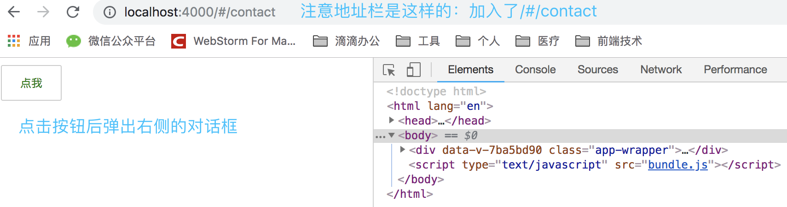
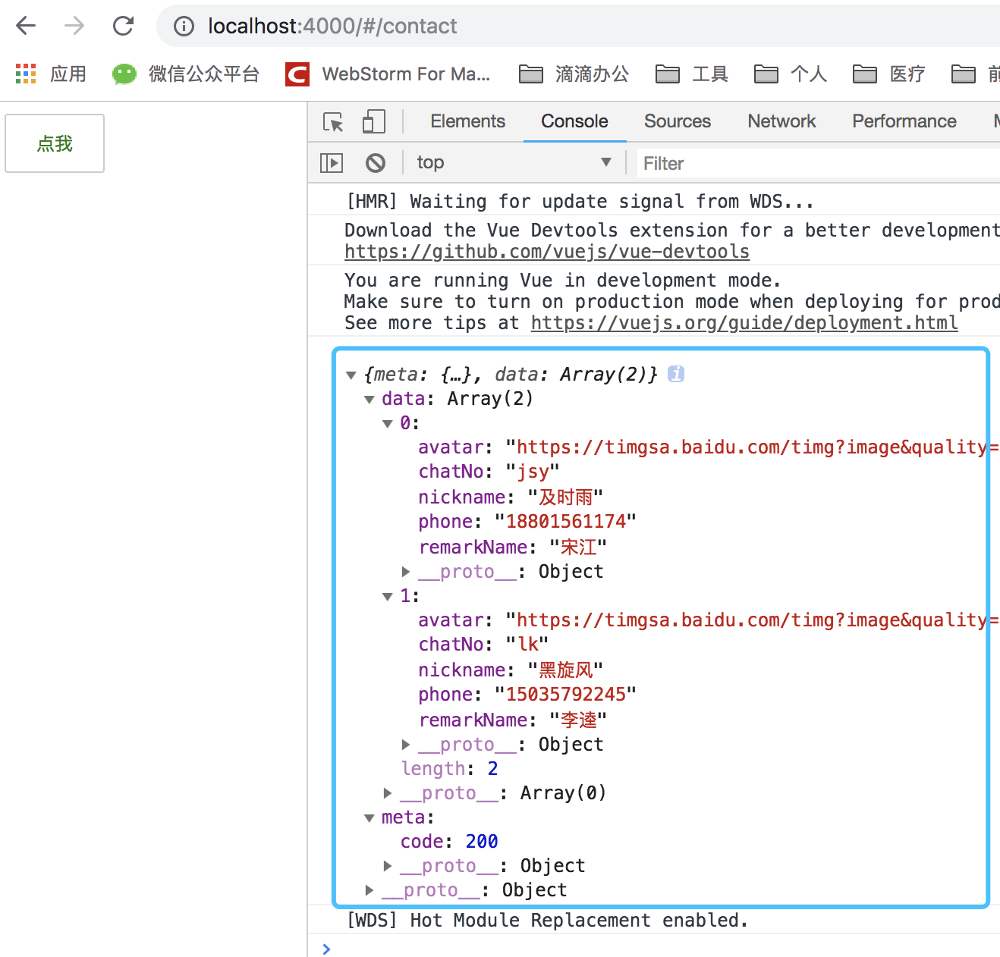
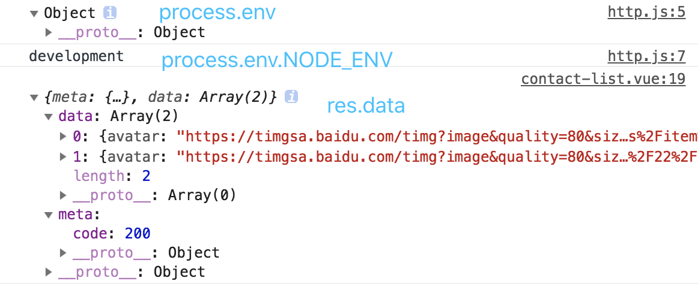

# 基础代码建设
我们的目标是模仿微信，但是目前我的能力无法一蹴而就，设计全面。所以需要一点一点实现，一步一步完善，这一节以微信中第一个Tab-"微信"为例，开始做基础代码的建设

微信中Tab分为四大块：微信、通讯录、发现、我

我准备在pages目录下面创建四个子目录来开发上面四大模块
* 微信-chat
* 通讯录-contact
* 发现-discovery
* 我-me

下面就以contact作为开始，来建设基础代码
## 一个Button组件
在components目录下创建Button.vue组件
```vue
<template>
  <button class="button" @click="handleClick">
    <slot></slot>
  </button>
</template>

<script>
  export default {
    name: 'zyButton',
    methods: {
      handleClick () {
        this.$emit('click')
      }
    }
  }
</script>

<style scoped lang="scss">
  .button{
    padding: 10px 20px;
    border: 1px solid #ccc;
    border-radius: 2px;
    outline: none;
    font-size: 12px;
    color: green;
  }
</style>
```
## 一个contact-list页面
在pages目录下创建contact目录，然后再在contact目录下创建contact-list.vue文件，
这个页面就是微信中通讯录中联系人列表的页面，不过咱们的页面目前只有一个按钮，和微信"相去甚远"
```vue
<template>
  <zy-button @click="handleClick">点我</zy-button>
</template>

<script>
  import Button from '../../components/Button.vue'

  export default {
    components: {
      zyButton: Button
    },
    methods: {
      handleClick () {
        alert('点我了  你好')
      }
    }
  }
</script>

<style scoped>
</style>
```
这个文件中我们使用`import Button from '../../components/Button.vue'`导入了Button.vue组件，然后使用如下代码注册该组件
```js
components: {
  zyButton: Button
}
```
`zyButton`就是将来在`<template>`中使用该组件的方式（即zyButton就是标签名），驼峰转为中划线的方式

## 一个路由
现在咱们已经写好了组件，写好了页面，并且在页面中也是用了组件，接下来要完成如何才能访问到contact-list.vue页面呢？答案就是使用路由


路由的使用又分为三个步骤：
1. 引入vue-router
2. 告诉router在哪里渲染这些组件(页面)
3. 将组件(页面)映射到路由

### 引入router
首先执行下面的命令去安装vue-router
```
npm i -D vue-router
```
### 指定渲染的位置
打开App.vue文件，内容修改如下：
```vue
<template>
  <div class="app-wrapper">
    <router-view></router-view>
  </div>
</template>

<script>
  export default {
  }
</script>
<style scoped lang="scss">
  
</style>

```
### 页面映射到路由
其实就是对路由的配置，在router目录下创建index.js文件，内容如下：
```js
import Vue from 'vue'
import VueRouter from 'vue-router'

import contactList from '../pages/contact/contact-list.vue'

Vue.use(VueRouter)

const routes = [
  {
    path: '/contact',
    component: contactList
  }
]

const vueRouter = new VueRouter({
  routes
})

export default vueRouter
```

解释上面这段代码：
* `import Vue ...`和`import VueRouter ...`两行代码引入vue和vue-router
* `import contactList ...` 引入刚才咱们编写的contact-list.vue页面
* `Vue.use(VueRouter)`是将vue-router插件注册到vue中，这是vue使用插件的同一方式
* `const routes ...`是定义路由配置，其中`path`指定路径（此处是 /contact），`component`指定该路径下应该渲染的页面（此处是contact-list.vue页面）
* `const vueRouter` new一个vue-router的实例，并且向options传入刚才配置的路由routes
* `export default vueRouter`是导出路由实例
### 入口文件中注入路由
打开src目录下面的index.js入口文件，然后修改代码如下：
```js
import Vue from 'vue'
import App from './App.vue'

import router from './router/index.js'

new Vue ({
  el: '#app',
  render: h => h(App),
  router
})
```

上面引入了router实例，然后在new Vue实例时向其传入router配置，从而让整个应用自此拥有了路由功能。


现在可以`npm run dev`了，看看效果吧


到这里，虽然看到了预期的效果，但可能你会很迷糊，这个页面到底是怎么出来的？上面各种创建文件，各种撸代码，解释的也不够清楚。所以我再尽可能详细的屡屡思路，梳理代码的完整执行流程。
从源头开始讲起。

* 命令行输入`npm run dev`，服务器加载index.html文件
* `html-webpack-plugin`插件会把entry指定的入口文件src目录下的index.js文件注入到index.html文件中
* 此时代码执行index.js文件，这个文件new Vue实例时传入的el配置项和render配置项告诉程序传入render函数的App组件之后将被渲染在el指定的dom节点中，替换掉el指定的dom节点里面的内容
* 继续执行index.js文件，发现new Vue实例时还传入了一个router配置项，现在vue就知道了有人给它注入了路由功能，现在它已经寻找到了路由的相关配置（即router目录下的index.js文件），接下来的任务就是寻找路由对应的组件我将来在哪里进行渲染呢？
* 于是程序就去渲染src目录下的App.vue文件，然后发现该文件中有`<router-view></router-view>`这样一段代码，这个代码就是给路由预留的地方，意思是："告诉vue将来路由对应的组件你就往这里渲染。我给你留地了"
* 到此一切准备就绪，程序静静地等待浏览器来访问它
* 浏览器中输入`localhost:4000/#/contact`，程序判断出此时的URL正好与路由配置中的`{path: '/contact', component: contactList}`这项配置的path属性匹配上
* 匹配上之后就去加载component属性指定的contact-list.vue组件
* 加载contact-list.vue组件时发现，在这个组件中又引入了Button.vue组件
* 于是就又去加载Button.vue组件
* 加载完毕后，华丽的将contact-list.vue放到`<router-view></router-view>`中，至此，***Game Over***
# 调用接口获取数据（ajax请求）
后端是另一个项目，采用nodejs(express框架)+mongoDB+mysql(待定)。。。，本节不用关心后端的事情，因为这里只是简单的打通调用后端接口的路。

vue官方推荐的ajax库叫做axios，用法非常简单，只要熟悉jquery中的ajax或者原生js中的ajax，当然如果再熟悉Promise，那就没啥好说的，入门非常容易，直接上代码

## 下载安装axios
首先咱们先下载安装axios
```
npm i -D axios
```
## 引入并使用axios
打开contact-list.vue文件
```vue
...
<script>
  import Button from '../../components/Button.vue'

  import axios from 'axios'

  export default {
    components: {
      zyButton: Button
    },
    methods: {
      handleClick () {
        alert('点我了  你好')
      }
    },
    created () {
      axios.get('http://localhost:3000/findContacts').then(res => {
        console.log(res.data)
      })
    }
  }
</script>
...
```

通过`import axios from 'axios'`引入axios，然后在created()生命周期方法中写入上面的代码。启动后端接口服务器，然后刷新页面就会看到控制台输出数据了。


## 当后端服务器代码，并启动
可惜的是你那看不到这个东西，而是报错了，那是因为你还没有启动后端接口服务器。

代码中的接口地址就是我写的一个demo地址，下面跟着我其启动接口服务器吧。

后端服务器代码github地址为：https://github.com/codepan/zychat-server

依次执行以下命令：
```
git clone git@github.com:codepan/zychat-server.git
cd zychat-server
npm install
node app.js
```
此时就会在本地3000端口启动服务器，再次刷新页面，就会看到上面的数据在控制台输出。

# 安装sinoiov-ui组件库
这个组件库是我自主研发的一个基于vue2.*的组件库，里面包含了很多常见的组件。

引入它的目的是帮助我们快速开发产品，精力集中在业务代码上，而不是组件上，之前写了一个Button组件，呵呵，那Button组件简直没法看，所以将用组件库中的Button组件去替代它。还有接下来咱们封装axios时会用到Loading组件，用来请求接口时给与用户一个反馈。

```
npm i -D sinoiov-ui
```
安装之后，还需要做一些事情才能在vue文件中使用，但是目前先什么都不做，因为下面会现在js文件中去使用它。

# 封装axios
不用封装直接像上面那样引入axios，然后axios.get或者axios.post等等发送异步请求也是没有任何问题的，但是作为一个过来人，我想说：当项目越来越大，接口请求越来越多的时候就会发现，不封装axios会产生非常多的冗余代码。

举一些冗余的例子：
* 发送请求前，需要对请求参数做组合或者包装
* 发送请求中，需要显示loading，表示进度
* 收到响应后
  * 关闭loading
  * 将响应数据转换为json形式
  * 若成功，显示成功的提示
  * 若失败，显示失败的提示
  * 若token或者session过期，需要提示用户，并重新登录
* 配置响应超时时间
* and so on

这一切的一切如果不做封装，那发送请求很快就会成为一场噩梦！！！

不知你是否还记得在之前咱们创建的src/common/js/http.js这个文件？它就是咱们用来封装axios的地方，说干就干，打开这个文件。

首先下载安装axios
```
npm i -D axios
```
然后在http.js文件中写入如下的代码：
```js
import axios from 'axios'
import {Loading} from 'sinoiov-ui'

/* eslint-disable no-undef */
const baseURL = process.env.NODE_ENV === 'development' ? window.config.baseURL.development : process.env.NODE_ENV === 'production' ? window.config.baseURL.production : window.config.baseURL.test

const $http = axios.create({
  baseURL,
  timeout: 30000
})

$http.interceptors.request.use(request => {
  Loading.open()
  return request
}, error => {
  return Promise.reject(error)
})
$http.interceptors.response.use(response => {
  Loading.close()
  return response
}, error => {
  return Promise.reject(error)
})

export default $http

```
我不敢再继续封装继续写代码了，因为简单这么几行代码我想我应该需要解释好长时间，因为这里面有太多的未知东西需要去阐述。接下来一行一行去分析上面的代码，在分析的过程中将无法避开不去延伸扩展讲解某些（其实是很多）知识点，
所以你需要做好准备。

***如果在这之前到文章开头的东西你都是云里雾里的话，那我建议再读几遍，然后再接着向下看***。

下面我来解释一下上面的(http.js)代码

`import axios from 'axios'` 引入axios
  
`import {Loading} from 'sinoiov-ui` 单独引入sinoiov-ui中的Loading模块，使用它会显示或隐藏loading

`const baseURL = process.env.NODE_ENV === 'development' ? window.config.baseURL.development : process.env.NODE_ENV === 'production' ? window.config.baseURL.production : window.config.baseURL.test`

这行代码里面需要解释下面三点：
1. 问题1：定义baseURL这个常量是个什么鬼？
2. 问题2：process.env.NODE_EVN是个什么鬼？
3. 问题3：window.config.baseURL.xxx是个什么鬼？

#### 问题1和2
前两问题我打算放在一块来讲，因为这两个东西放在一块的意思就是-***"根据环境确定baseURL"***。那么问题来了，为什么要根据环境确定baseURL？回答这个问题需要搞懂四个问题：
1. baseURL是什么？
2. 环境是什么？
3. 为什么要区分环境？
4. 环境如何区分？

  * baseURL是什么？
  
    baseURL就是接口地址前面固定不变的那串东西，一个项目接口地址都是有规律可循的，例如用户注册登录两个接口可能形如：http://xxx.xxx.com/api/login和http://xxx.xxx.com/api/register，那么baseURL就是http://xxx.xxx.com/api/
  不设置baseURL的话，每次请求都需要写前面这么一大串东西，很是麻烦
  
  * 环境是什么？
  
    环境通俗点讲就是目前项目所处的阶段：开发阶段？测试阶段？生产阶段？对应到环境上面就是：开发环境、测试环境和生产环境
 
  * 为什么要区分环境？
  
    因为不同的环境接口请求前面的baseURL地址是不一样的，因为测试服务器和生产服务器肯定不是同一台机器呀，自然而然地址就不一样。开发环境和测试环境接口地址可能是同一个。
    当然在开发阶段也经常出现下面的这种情况，就是现在要调试A同学写的接口，此时接口地址就是A同学的机器，过一会要调试B同学写的接口，此时接口地址就是B同学的机器，因为这样调试起来快啊。不然A或者B开发完都要放到测试服务器上然后才能调试，如果有问题又得重复
    部署一次，很是麻烦。所以在开发阶段，一般都是调试谁的接口，就连接谁的机器。所以也就要区分环境。

  * 环境如何区分？
  
    区分环境有两种实现方式：
    * 通过window.location.hostname判断host来区分
    * 通过nodeJS的process.env.xxx来判断
     
      process.env又是什么呢？process是nodeJS内置的一个模块，它是干什么的这里不展开，env是process的一个属性，env又是一个对象，这个属性表示当前nodeJS的执行环境，我们可以在package.json中的scripts配置项中配置的命令中，向env属性动态添加key-value，
      例如我们添加一个NODE_ENV的key，NODE_ENV的值是"development"，届时我们就可以使用process.env.NODE_ENV来获取到设置的"development"这个值。
        
      在我以前开发的项目中，都是采用第一种方式通过host来区分环境的，但是那样显得有些低端，并且也存在一些问题（具体有什么问题我这里也不展开讲了）。所以本项目我将采用process.env的方式来进行环境区分
     
 经过上面的分析，问题1，2相信你已经基本上搞懂了，现在还剩下：process.env.NODE_ENV如何来搞的问题。
 
 首先说`NODE_ENV`这玩意跟nodeJS跟webpack半毛钱关系都没有，完全就是前端工程师约定俗成的一个自定义的变量（用来判断环境）而已。
 
 现在我定下来系统包括两个环境，一个开发环境，一个生产环境，没有测试环境哦，因为*自己开发，自己测试，哈哈！！*
 * 开发环境：`NODE_ENV=development`
 * 生产环境：`NODE_ENV=production`
 
 想想看，在什么地方我们能知道当前程序是在开发环境还是在生产环境？？ 。。。。。 20s过去了，还记得前面我说过在package.json中的scripts配置项下面的dev和build配置项中可以设置参数吗？
 没错，突破口就在这里：
 * npm run dev 不就是告诉程序当前在开发环境吗？？
 * npm run build 不就是告诉程序当前在生产环境吗？？
 
那好，就在这两个命令里面定义上面的NODE_ENV环境变量
```
 "scripts": {
    "dev": "NODE_ENV=development webpack-dev-server --inline --hot --port 4000",
    "build": "NODE_ENV=production webpack --config webpack.config.js"
  },
```
#### 问题3
window.config.baseURL.xxx能看出来这是在全局对象window上面挂载了一个config对象，这个对象里面配置项目在不同环境下所需的baseURL。

首先先来看看这个东西写在哪里，又是如何工作的呢？

项目根目录创建一个config.js文件，然后在这个文件中写入如下代码：
```js
window['config'] = {
  baseURL: {
    development: 'http://localhost:3000/',
    production: 'http://localhost:3000/',
    test: ''
  }
}
```
然后再打开根目录下面的index.html文件，引入这个config.js文件：
```html
<!DOCTYPE html>
<html lang="en">
<head>
  <meta charset="UTF-8">
  <title>Title</title>
  <script src="config.js"></script>
</head>
<body>
  <div id="app"></div>
</body>
</html>
```

这下明白http.js文件中window.config.baseURL.development、window.config.baseURL.production和window.config.baseURL.test这三个东西是怎么来的了吧。

我猜想你会问我，为什么要这么大费周折，将它定义在config.js文件里，然后再在index.html文件中引入这个config.js，然后在http.js中引用呢？为什么不直接定义在http.js文件中呢？

下面的这段解答，有一定大型项目经验的话会更容易理解一些：
* 如果定义在http.js文件中，那么上线之后哪天接口地址变了，仅仅是接口地址变了，你不得不进到http.js文件中手动修改，然后再build，然后上线，因为线上的代码都是压缩混淆之后的，根本无法修改。
* 如果把它定义在一个单独的文件中(config.js)的话，我们可以通过配置，让webpack不要打包，不要压缩混淆这个config.js文件，而是原封不动的将其输出出来，这样我们线上代码中就会看到这个config.js文件，这样修改接口地址等等修改其他的全局配置的东西，
就不需要再去改源码了，而是直接在服务器上就能操作完成。


剩下下面的这些代码我将采用注释的方式作以讲解
```js
/*
create()方法产生一个axios的实例，在这里将这个实例命名为$http
create()方法接受一个options作为参数，其中
  baseURL相当于baseURL: baseURL 以后请求时只需要写相对请求地址即可，axios会自定在前面拼接上baseURL
  timeout: 30000 设置请求超时时间为30s
*/
const $http = axios.create({
  baseURL,
  timeout: 30000
})

/*
interceptors是axios配置拦截器的方式
request.use是配置request拦截器
request拦截器的意思就是请求在真正的被发送之前需要执行的某些逻辑

use()方法接收两个函数作为参数，第一个为成功回调函数，第二个为失败回调函数
成功回调函数中我们打开了一个loading
失败回调函数中我们返回了Promise.reject(error)，返回这个东西就会触发Promise的catch回调
 */
$http.interceptors.request.use(request => {
  Loading.open()
  return request
}, error => {
  return Promise.reject(error) // 这段如果理解不了，可以先放着不用管
})

/*
interceptors是axios配置拦截器的方式
response.use是配置response拦截器
response拦截器的意思就是请求在收到响应后需要执行的某些逻辑

use()方法接收两个函数作为参数，第一个为成功回调函数，第二个为失败回调函数
成功回调函数中我们关闭了loading
失败回调函数中我们返回了Promise.reject(error)，返回这个东西就会触发Promise的catch回调
 */
$http.interceptors.response.use(response => {
  Loading.close()
  return response
}, error => {
  return Promise.reject(error)
})

export default $http // 到处$http实例
```


OK，到此这个http.js文件我们就讲解完了，下面就要用它发送http请求了，替代掉原生的axios。

首先打开入口文件index.js:
```js
import Vue from 'vue'
import App from './App.vue'

import router from './router/index.js'

import $http from './common/js/http.js' // 引入$http实例

// 将$Http实例挂载到Vue的实例上面，将来在vue文件中就可以使用this.$http来调用$http实例了
Vue.prototype.$http = $http

new Vue ({
  el: '#app',
  render: h => h(App),
  router
})
```

然后打开contact-list.vue文件：
* 删除掉这段代码`import axios from 'axios'`，因为已经全局引入了$http
* 修改发送请求的那段代码为如下：
  ```js
  this.$http.get('findContacts').then(res => {
    console.log(res.data)
  })
  ```
可以看到`http://localhost:3000/findContacts`这个地址变成了`findContacts`，是不是简洁了好多，这就是baseURL的功劳，它会帮助拼接真正的URL---baseURL + 'findContacts'

到此为止，我们可以在http.js加入下面两个输出，然后启动项目，看看控制台会输出什么？
```js
/* eslint-disable no-undef */
console.dir(process.env)
/* eslint-disable no-undef */
console.log(process.env.NODE_ENV)
```
那两行注释是告诉eslint不要校验变量未定义的错误，process是全局变量所以根本不需要定义，eslint太弱智了，不加注释编译会报错，不用理解注释是什么意思，照做就行

`npm run dev`看看控制台Console:



完美，请求又再次成功了，仔细的你会发现一个诡异的事情：process.env是个空对象，为什么process.env.NODE_ENV却有值，值是development？这个问题我也不知道，目前还没有搞明白是什么原因（捂脸，很害羞哈）。

控制台输出的development难道真的就是`"dev": "NODE_ENV=development webpack-dev-server --inline --hot --port 4000"`这里定义的这个吗？

做个试验，将`development`改为`dev`，然后重启项目，查看控制台的输出，MLGB，果然依旧是development，这又是为什么呢？这个development究竟从何而来？
这个问题我知道，我告诉你吧，它来自webpack.config.js文件中的mode配置项，不信的话你可以修改它试试，前提是这个mode取值只能是：none、development或production，不要乱填，不然就报错了。

也就是说：其他文件（除过webpack.config.js）中process.env.NODE_ENV这个玩意已经被webpack4.*固化为自己的东西了，webpack.config.js中的mode配置项就相当于给全局属性process.env属性上面挂了一个NODE_ENV的属性，值就是mode的值
```
{
  mode: 'development'
}
// 就相当于
process.env.NODE_ENV = 'development'
```

为什么说除过webpack.config.js文件呢？因为你可以在这里输出一下process.env.NODE_ENV看看，它的值却是package.json中定义的那个值。


那也就是说之前在package.json中的scripts配置项里面折腾半天，一点鸟用也没有？当然不是，我们需要把mode的值变成process.env.NODE_ENV，你说是不是？
这个npm run dev时mode就是development，npm run build时mode就是production。

>悄悄告诉你：
>* mode这个鬼玩意我之前也不知道，这是个坑(webpack4.*以后)
>* 在webpack3.*以及以前的版本中，没有mode的概念，实现环境的判断还需要一个DefinePlugin的webpack插件才能搞定
>* webpack4.*中动态修改mode即可

但是这样是有局限性的，因为mode取值只能是：none、development或production这三个值，而我们的环境中有test环境，只是目前项目没有用test环境而已，那以后要用怎么办？
`mode: 'test'`是会报错的，呃，好吧，看来还是需要动脑筋啊。不过以后用到再说，真的不敢再讲了，再讲这节成为天书就可不好了。


