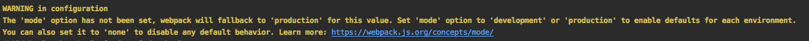
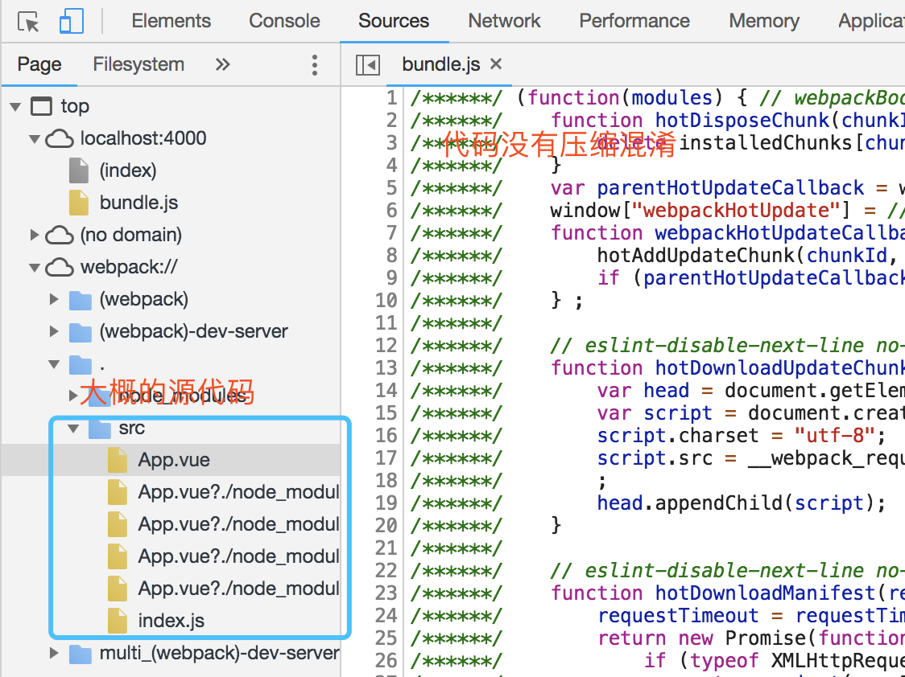
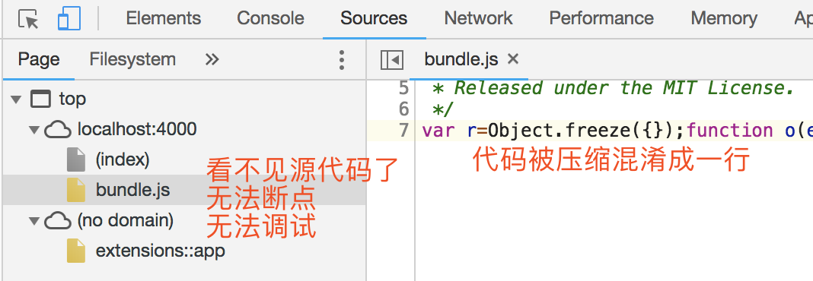
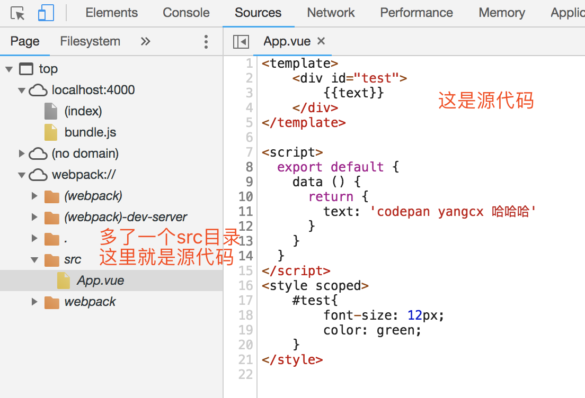

## webpack的mode配置项
dev2中可以很爽的运行`npm run dev`来开发调试项目了，但是会发现命令行会有如下一段警告，这个警告可能你已经看到很久了，太烦了，接下来就去处理它

翻译：webpack配置文件中缺少了mode配置项，该项默认为production，可选值是development或production或none

那就去配置一下吧，但是为什么要配置它，它是干什么的我们得心中有数，不能稀里糊涂。好吧，一顿查阅，得到下面的"知识"

> Webpack4增加了mode配置项，支持配置 production、development、none三个可选配置，默认为production

mode 的作用可以简单概括为把各个环境常用的配置缩减为一个配置。

* 配置为 development 背后实际上是包含了如下配置
```
module.exports = {
 devtool: 'eval',
 plugins: [
   new webpack.NamedModulesPlugin(),   
   new webpack.NamedChunksPlugin(),  
   // 设置环境变量为development
   new webpack.DefinePlugin({ "process.env.NODE_ENV": JSON.stringify("development") })
 ]
}
```
* 配置为 production 背后实际上是包含了如下配置
```
module.exports = {
  mode: 'production',
  plugins: [
    // 压缩JS
    new UglifyJsPlugin(/* ... */),
    // 设置环境变量为production
    new webpack.DefinePlugin({ "process.env.NODE_ENV": JSON.stringify("production") }),  
    // 作用域提升
    new webpack.optimize.ModuleConcatenationPlugin(),  
    new webpack.NoEmitOnErrorsPlugin() 
 ]
}
```

上面的配置是什么鬼？简直是天书，超出了我的能力范围，于是继续查阅，实验，然后在浏览器中发现了一些重大的不同：
配置方法是：打开webpack.config.js文件
```
module.exports = {
  mode: 'development', // production | none
  ...
```
* mode为development时
    * bundle.js没有压缩
    * 能看到"***大概的***"源代码
    
* mode为production时
    * bundle.js被压缩和混淆，大大缩小了文件的大小，但是简直没法看，反正我是看不懂
    * 看不到源代码了，无法断点，无法调试
    
    
    
注意我的措辞："大概的"，打开浏览器中App.vue和index.js文件就会发现，其实那个代码仍然还是被webpack处理后的，调试起来仍然很费劲。
那有什么办法可以看到真正的源代码呢？卖个关子，请继续看下一节。
## webpack的devtool配置项
其实我自己都没想到会有这一节内容，本就想解决个因为mode配置项产生的警告问题，结果却引出了这个devtool配置项，现在讲它好像还有些为时过早：一行代码都没写，没有错误，调试个毛线！
但是话赶话赶到这了，那就干脆讲了吧！

devtool是什么？说实话，只有知道它有哪些取值，自己试着改一下取值然后再看浏览器中的表现，就知道这东西是干啥的了。
大概作用是：devtool不同的配置有些不同的效果，比如是否保留注释、是否保留行信息、是否映射源代码等等，总之就是开发阶段使用的一个工具。
它有好几种取值，默认的取值是：'#cheap-module-eval-source-map'。现在将其配合为如下取值：

打开webpack.config.js文件
```
module.exports = {
    ...
    devtool: '#source-map'
}
```
重新运行`npm run dev`，重启server，在查看浏览器控制台


看到源代码了，尽情的调试吧！点到为止，不敢再讲了，因为再讲你（我）就（也）迷（bu）糊（会）了（了）。其他配置项和想了解更多，自行百度。
