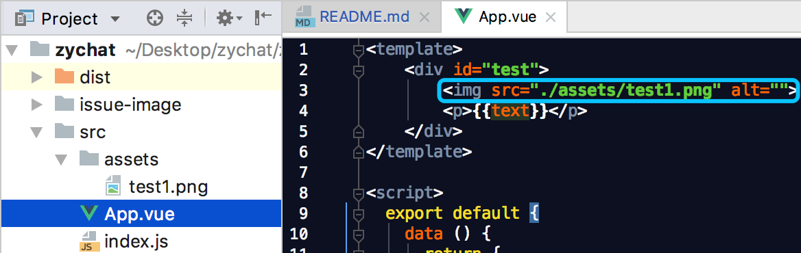

# 项目中引入静态资源（以图片为例）
图片在项目中是不可或缺的一部分，css的`background`可能需要引入图片，html的``也可能需要引入图片，首先咱们得先给这些图片安排个位置，存放下来，
然后再去引用人家吧。

其实图片放在哪里这个并没有强制要求，但是咱们得与国际接轨（vue官方推荐的目录）。使用vue-cli生成的项目目录里面会存在两处存放图片的位置：
* 一处是src目录下面的assets目录
* 一处是根目录下面的static目录

为什么会有两个目录来存放图片呢？这个问题也困扰了我好久，它们的不同点在哪里？一张图片我因该存放在哪里？各自的优缺点是什么？好吧，疑问太多了。

我不打算一上来就跟教科书一样罗列一大堆概念，我看不懂你更看不懂，我打算从实践出发（实践才能出真知）。

首先咱们创建这两个目录，。。。10秒过去了，假设你已经创建好了这两个目录，现在随便找一张图片（尽量小点）放如assets目录中


我整了一个`test1.png`的图片放在assets目录下，注意static目录和assets的目录位置不要放错哦

然后再修改一下App.vue文件，在文件中引入test1.png这样图片，修改如下：
```vue
<template>
    <div id="test">
        
        <p>{{text}}</p>
    </div>
</template>

<script>
  export default {
    data () {
      return {
        text: 'codepan yangcx 哈哈哈'
      }
    }
  }
</script>
<style scoped lang="scss">
    $color: red;
    #test{
        font-size: 12px;
        color: $color;

        width: 200px;
        height: 200px;
        border: 1px solid blue;
        border-radius: 20px;
    }
</style>
```

其实也没改啥，就是引入一张图片而已，然后给`{{text}}`加了一个`<p>`标签，仅仅为了好看一些，其实仍然很丑

`npm run dev`快去浏览器中欣赏你引入的那张图片吧，不幸的是，命令行报错了


说是错误发生在test1.png这个文件中，模块解析失败：意料之外的 '?'字符（你妈，说的啥，完全看不懂，明明是张图片，哪来的'?'号）。
重点在这句话：你可能需要一个合适的loader来处理这种文件类型。

好吧，现在大概知道解决办法了。处理vue文件有vue-loader；处理css文件有style-loader、css-loader；处理sass文件有sass-loader。
那么png文件是不是有png-loader？jpg文件是否有jpg-loader？。。。。想法不错，只是想的不够通用，局限性太大，因为图片格式有很多种（png|jpg|jpeg|gif|svg|bmp|psd|...）。那么每一样来个loader岂不被累死，
这个loader被统一叫做`file-loader`***（埋个伏笔：这个loader有一些缺点，后面我们会用一个更牛逼的loader来代替它）***
```
npm i -D file-loader
```
然后打开webpack.config.js文件，加入该loader
```
  module: {
    rules: [
     ...
      {
        test: /.png/,
        loader: 'file-loader'
      }
    ]
  }
}
```
在rules的最后面配置如上的代码，然后运行项目


看到图片了吧，页面瞬间高（并）大（没）上（有）了很多。

通过一张图片，我们难以发现这个loader有什么缺点，如果再引入成百上千张图片问题就会暴露出来，但是这种抛砖引玉的方法成本有些大，项目搭建起来我就被累瘫了，
所以我就直接讲吧！但是得做好心理准备，项目经验相对匮乏的话会比较晦涩难懂，如有电商项目经验那就***浅显易懂***（成语好像用错了？没文化，别笑话）。


为了彻底讲明白file-loader的缺点，引入更牛逼的`xxx-loader`，我思考了好久，感觉寥寥几笔无法讲明白，这是个说来话长的东西，必须从"盘古开天辟地以来"开始讲起（开个玩笑）：

***话题会跑到九霄云外（一定要做好心理准备，不然会不知所云）***

## 传统页面中引入图片的方式

传统的页面引入图片方式无非就是下面两种：
1. html中img标签的src属性

    ``
2. css中background的url属性

    `background: url('images/bg.png')`

以上两种方式总结一下：
* img标记的src属性或background的url属性都指定了一个远程服务器上的资源。
* 当网页被加载到浏览器中时，浏览器会针对每个外部资源都向服务器发送一次拉取资源的http请求，占用网络资源。
* 大多数的浏览器都有一个并发请求数不能超过4个的限制。这意味着，如果一个网页里嵌入了过多的外部资源，这些请求会导致整个页面的加载延迟。

这也就是面试时常被问及web性能优化中减少http请求的切入手段

N个静态资源（图片为例）就发送N个http请求的这种现象会无限削（拉）弱（低 ）网（你）站（的）体（逼）验（格）

对于这种现状，`DataURL`技术由此诞生

## DataURL
DataURL给了我们一种很巧妙的将图片“嵌入”到HTML中的方法。
跟传统的用img标记将服务器上的图片引用到页面中的方式不一样，在DataURL协议中，图片被转换成base64编码的字符串形式，并存储在URL中，冠以mime-type。
使用技术，会减少http请求，提升网页性能，图片数据以base64字符串格式嵌入到了页面中，与HTML成为一体，它的形式如下：
```

```
一串形如火星文的东西和平时指定网络资源加载图片的方式除了不再发起http请求之外没有任何区别，图片照样能完美的显示在页面中。

为什么要有DataURL技术，因为DataURL跟传统的外部资源引用方式相比，它有如下用处：
>* 当访问外部资源很麻烦或受限时
>* 当图片是在服务器端用程序动态生成，每个访问用户显示的都不同时
>* 当图片的体积太小，占用一个HTTP会话不是很值得时

当然任何事物都有两面性，DataURL也不例外，它也有不适用的场合：
>* Base64编码的数据体积通常是原数据的体积4/3，也就是DataURL形式的图片会比二进制格式的图片体积大1/3
>* DataURL形式的图片不会被浏览器缓存，这意味着每次访问这样页面时都被下载一次。
这是一个使用效率方面的问题——尤其当这个图片被整个网站大量使用的时候

然而，DataURL这些不利的地方完全可以避免或转化。

*（—以下这段话是我在网上抄的—）诚然，无法否认缓存在浏览器性能中的重要作用——如何能将DataURL数据也放入浏览器缓存中呢？答案是：通过CSS样式文件。CSS中的url操作符是用来指定网页元素的背景图片的，而浏览器并不在意URL里写的是什么——只要能通过它获取需要的数据。所以，我们就有了可以将Data URL形式的图片存储在CSS样式表中的可能。而所有浏览器都会积极的缓存CSS文件来提高页面加载效率。*

好了，不扯了，再扯就超出教（我）程（能）的（力）大（范）纲（围）了。

总之一句话（目前都这样玩）：***为了优化网页性能减少资源的http请求，结合DataURL技术的优缺点，我们最终的实现方案是：设定一个判定图片大小的值，尺寸小于该值的图片采用DataURL形式，反之原采用HTTP加载的形式***


## `file-loader`
为了实现上面我们的夙愿，`file-loader`略显乏力，而引出替换`file-loader`的神秘loader之前，我得先给你讲清楚`file-loader`到底是干什么的？

file-loader 就是将文件（以图片为例，方便理解，其他的还有字体文件等）在进行一些处理（主要是处理文件名和路径）后，将图片移动到打包后的目录（本项目的dist目录）中。

用事实说话，下面就跟着我去验证上述的结论

命令行运行`npm run build`打包项目，然后看到打包后输出了一个dist目录，打开这个目录，长的像下面这个样子：


源代码（src目录长这个样子）：


对比两图，看图说话，`file-loader`处理的内容主要包括：
1. 文件名的处理：源图片名`test1`被file-loader处理后变为`2c8d5f24...`
2. 路径的处理：源图片路径在`src/assets`目录下，被file-loader处理后变为dist目录下

命令行运行`npm run dev`启动项目，然后在浏览器控制台中查看:


再看源代码App.vue文件中是怎么引入图片的：



对比理解后我们又会得出一个`file-loader`的一个作用：？？？（这个作用至关重要，所以我不想直接告诉你，需要你跟着我一步一步去理解，然后自己悟出来）

试想`file-loader`这家伙前两个作用一个是修改了文件名，一个是把文件从src/assets目录"偷偷的"搬到了dist目录，经过这两步操作后如果`file-loader`就此"结束自己的使命"，那么项目运行起来会发生什么？

图片会404，页面上看不见图片了，why？why？why？看我下面的分解


因为源代码中


我前面也已经讲过`npm run dev`的原理，这里我再复习一下：`npm run dev`后实际上是webpack-dev-server会build项目，生成一个目录（具体叫什么我也不知道，但我知道它类似咱们build后的dist目录），然后将该目录存放在运行内存中（磁盘上不存在哦）。也就是说此时浏览器加载的是运行内存中的这个目录，所以什么src目录或其它目录或者文件都是通通不存在的。

而我们源码中图片是这样引入的：``，你说说不404可能吗？首先src目录不存在（assets目录更不可能存在），再者`test1.png`也不会存在，早已被`file-loader`转换成了`2c8d5f24~~~.png`。

所以`file-loader`的另一个作用也就浮出水面了：***修改资源的引用地址（例如img的src）***

eg：

``````

被修改为

``````


处理之后，图片也就正确的被引入了，而不会404，找不到资源。

`file-loader`虽然可以帮我们处理图片资源，但是它那不论图片大小都是发送http请求资源的缺点我不能容忍，
在实际开发中，将一定大小以下的图片转为DataURL形式（base64字符串），非常有利于加载速度的提升。

于是我继续寻找它的替代方案。。。
## url-loader
`url-loader`个人感觉比`file-loader`更加强大，这就是我前文提及的*伏笔*和*神秘loader*

它的强大之处在于它可以允许我们设定一个用来判定图片大小的阈值，然后它会根据这个阈值来动态的调整处理图片的方式：
* 小于阈值，小图片，采用DataURL处理图片
* 大于阈值，大图片，采用HTTP处理图片

其中采用HTTP处理图片的功能其实就是`file-loader`的功能，也就是说url-loader包含了file-loader的功能，但是***url-loader并不是依赖于file-loader***（敲黑板：请牢记这一点）

抛弃file-loader，投向url-loader的怀抱吧

首先先删除之前安装的file-loader
```
npm uninstall -D file-loader
```
然后安装url-loader
```
npm i -D url-loader
```
安装后打开webpack.config.js文件，将`file-loader`改为`url-loader`

见证奇迹的时刻`npm run dev`，页面图片正常显示了（成功一大半），打开浏览器控制台看看代码：


图片被url-loader处理成了DataURL的形式，url-loader着实强大----file-loader能干的它能干，不能干的它还能干。但是这么使用url-loader有些low，告诉url-loader哪些算小图片，哪些算大图片，采用不同方式去处理才是url-loader的正确打开方式

url-loader在配置时可以向其传入limit参数，来告诉它图片大小的阈值。***在webpack中向loader传递参数都是通过options配置项传递的***

也就是说我们接下来需要在url-loader配置项中再加一个options配置项，然后在其中配置limit参数，向下面这样:
```
{
    test: /.png/,
    loader: 'url-loader',
    options: {
      limit: 1024 * 20 // limit的单位时byte，这里1024*20意思就是20KB
    }
}
```

现在重启项目，看会发生什么：


报错了，错误发生在test1.png文件中，模块build失败：原因是找不到`file-loader`模块？嗯？什么鬼？为什么在加limit参数之前，编译不报错，
加上limit限制之后就报错了呢？

这是因为不加url-loader默认是没有limit限制的，无论图片的大小它都会以小图片对待（DataURL的方式进行处理），而咱们加了limit限制之后，由于limit等于20KB，而test1.png图片的大小是37.2KB，也就是test1.png会被url-loader按大图片处理（HTTP的方式处理），按HTTP方式处理的功能恰巧就是file-loader的本领啊，所以url-loader完全没有必要重复造轮子，于是就干脆直接通知file-loader去处理这张图片了。

不幸的是之前我教你删除了file-loader（其实我是故意删除的，因为我想让你明白url-loader需要配合file-loader使用，但是又不完全依赖与file-loader）。来安装回来：
```
npm i -D file-loader
```
再次重启项目，发现图片又能成功显示了。并且资源加载方式又变回http的形式了，自己看看控制台。
这里需要注意：url-loader不需要配置什么file-loader依赖，因为上面已经说了，url-loader不依赖于file-loader，只是在某些时候（对大图片的处理）会把锅甩给file-loader去做仅此而已。

你可以自行做一下试验，需改limit的值，然后观察url-loader会（一）不（定）会按照我讲的原理去处理test1.png。

灵活的两种处理图片的方式我让很爽，但是问题又来了，我在assets目录下面又引入了两张图片：test2.jpg和test3.jpeg


然后打开App.vue，引入这两张图片
```
<template>
    <div id="test">
        
        <!-- 引入新添加的两张图片 -->
        
        
        <p>{{text}}</p>
    </div>
</template>
```
OK，重启项目，命令行看到如下的内容，恭喜你，又要GET到新知识了


报告缺少loader，记得webpack.config.js文件中配置url-loader时，test正则值匹配了png格式的图片，但是新引入的两张图片格式分别是jpg和jpeg，正则完全匹配不上，不报错才怪啊。
好吧，那就修改test正则吧：
```
{
    test: /.(png|jpg|jpeg|gif)/,
    loader: 'url-loader',
    options: {
      limit: 1024 * 20
    }
}
```
我自作多情的加上了gif格式，无可厚非啦，加上你也能理解啊，不用解释，重启服务，浏览器中收获喜悦吧（三张图片都能正常显示），我就不截图了。


