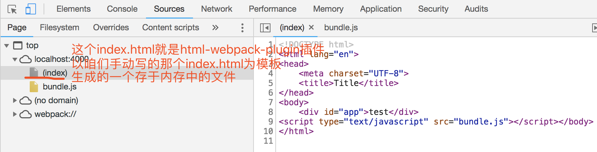

dev1的分支中我们初始化了一个最简单的vue项目架构，功能及其简陋到只能build后，手动创建一个html文件，然后再在html文件中引入build后的js文件，最后使用浏览器打开html文件。
上面描述的那段过程存在以下几个DT（蛋疼）的地方。
1. 只能build，无法直接运行看效果（即无法run dev）
2. 没有html文件，需要手动创建
3. html文件没有自动引入打包后的文件
4. 开发过程中，无法自动打开浏览器然后打开html页面
5. 无法实时刷新（热更新）

下面我们这个dev2的分支就解决以上几个问题，一个一个攻破。

首先看第一个问题：run dev的背后到底干了什么？

> "没吃过猪肉，总应该见过猪跑"。run dev之后本地启动了一个web server，然后浏览器被自动打开，然后咱们的html页面也被自动打开，然后修改代码发现浏览器还能实时刷新。

好吧 ，其实只要第一个问题解决了，其实也就顺带把剩下的几个问题一并解决了，所以，先解决2、3、4、5，最后1***迎刃而解***。

问题2：没有html文件，那咱就创建一个吧
项目根目录下创建index.html文件
```html
<!DOCTYPE html>
<html lang="en">
<head>
    <meta charset="UTF-8">
    <title>Title</title>
</head>
<body>
    <div id="app">test</div>
</body>
</html>
```

问题4，问题5：自动打开浏览器，自动打开html文件，实时刷新，想想这些肯定需要建立在有一个web server的基础上才是能够实现的，没有服务器，这一切都是白谈。

所以我们需要创建一个服务器，然后服务器去加载index.html文件，同时服务器需要就有以上自动打开浏览器和实时刷新的能力，你所想的我都可以给你，这个东西就是webpack的一个插件：webpack-dev-server

先别问我它是什么，先安装它再说
```
npm i -D webpack-dev-server
```

安装好之后我们需要运行它，运行也是在命令行直接敲命令就能运行，但是需要配置好多参数，命令行直接搞会累死的，那么回忆一下package.json文件中的scripts选项，没错，在这配置一下，就能快捷的运行它了。

打开package.json文件
```
{
 ...
  "scripts": {
   ...
    "dev": "webpack-dev-server --inline --hot --open --port 4000",
    "build": "webpack --config webpack.config.js"
  },
 ...
}
```
在scripts配置项中配置dev那段代码，到时候在命令行运行npm run dev就相当于执行了webpack-dev-server xxx的命令，解释一下命令中的参数的含义：
> 1. inline  自动刷新
> 2. hot 热加载
> 3. open 自动在默认浏览器中打开
> 4. port 指定监听端口为 4000 
> 5. host 可以指定服务器的IP，不指定默认为127.0.0.1（也就是localhost）

迫不及待的想去运行一把了，命令行中输入`npm run dev`，你会看到浏览器被打开了，并且自动打开了刚才我们在项目根目录下的index.html文件，是不是很神奇，这里又得解释一下了：

默认webpack-dev-server会在浏览器中打开项目下面的index.html文件，如果没有则会显示出项目的所有目录。可以做个试验：重命名index.html文件为test.html，你会发现项目目录显示在了浏览器里面，
那是因为webpack-dev-server傻眼了，找不到index.html文件，所以就只好显示项目目录了，不然报错多尴尬~~~


问题又来了，虽然打开了index.html，但是我们真正想看到的是APP.vue呀，可是现在index.html和APP.vue还半毛钱关系都没有，那怎么才能让它俩有关系呢？


想一下APP.vue文件是通过src目录下面的index.js文件导出的，然后webpack又是根据这个index.js文件打包后生成一个dist目录下面的bundle.js文件的，也就是说App.vue最终被webpack"折腾"成了bundle.js文件，
好，答案出来了：index.html文件中引入这个bundle.js文件，这样它俩的"红线"不就牵成功了吗？没错，就是这样的。

之前咱们在index.html文件中手动引入bundle.js简直是太low了，我们需要借助工具帮我们自动注入这个家伙，现在请这个工具闪亮登场：html-webpack-plugin
*（这是在解决问题3哦）*
>科普一下html-webpack-plugin
不好意思，其实我也太懂，就知道它可以加载html文件，并且可以将webpack.config.js文件中output配置项配置的输出文件自动注入到html文件中，就先了解这么多吧

安装它
```
npm i -D html-webpack-plugin
```
然后打开webpack.config.js文件，添加进这个插件，插件需要传入一个options，里面是一些配置
```
...
const HtmlWebpackPlugin = require('html-webpack-plugin')
module.exports = {
 ...
  output: {
    filename: "bundle.js",
    path: path.join(__dirname, 'dist')
  },
  ...
  plugins: [
    new VueLoaderPlugin(),
    new HtmlWebpackPlugin({
      filename: 'index.html',
      template: 'index.html',
      inject: 'body'
    })
  ]
}

```
引入html-webpack-plugin插件，然后在plugins配置项的数组中增加一个html-webpack-plugin实例，并且传入一些配置参数，解释一下：
> 1. filename html文件名，默认是index.html
> 2. template 指定你生成的文件所依赖哪一个html文件模板，模板类型可以是html、jade、ejs等。但是要注意的是，如果想使用自定义的模板文件的时候，你需要安装对应的loader哦。
> 3. inject 有四个值： true body head false
>   * true 默认值，script标签位于html文件的 body 底部
>   * body script标签位于html文件的 body 底部
>   * head script标签位于html文件的 head中
>   * false 不插入生成的js文件，这个几乎不会用到的

当然还有很多其他的配置属性，目前这三个就够了，多了你不懂我更不懂~~~

打开src目录下的index.js文件，修改代码如下：
```
import Vue from 'vue'
import App from './App.vue'

new Vue ({
  el: '#app',
  render: h => h(App)
})
```


OK，一切就绪，命令行输入`npm run dev`，发现页面完美展现了出来，页面中展示的内容就是APP.vue的内容
*（这是在解决问题1哦）*
可能你还有一个疑惑

疑惑：我们已经手动创建了一个index.html文件，插件把生成好的bundle.js文件注入到这个文件中不行吗？为什么还要以这个文件为模板，再去生成一个html文件呢？

答案：当你运行npm run dev之后，webpack-dev-server把由html-webpack-plugin生成好的index.html文件和由webpack打包好的bundle.js文件统统放到了电脑的内存中，然后浏览器去加载展示的
，这也就是为什么要再生成一个的原因，因为咱们自己写的这个index.html存在磁盘上，而由html-webpack-plugin插件生成的index.html存在内存中，两个完全不是一个东西，我们可以在浏览器控制台Elements和Sources两个面板看到这一点

Elements面板

Sources面板



这一节东西不多，但是挺难理解的。如果你看了3遍还没有看懂，那么请V我：13341128625

总共安装了两个东西，有不懂的自己再百度百度，哈哈
* `webpack-dev-server`
* `html-webpack-plugin`

